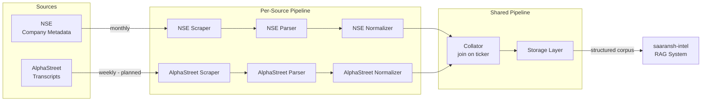

# Saaransh Data Platform — Architecture

## Problem Statement

Every quarter, management teams of 500 companies share critical insights on growth, margins, and strategy through earnings calls — yet most investors skip them because reading a 30-page transcript takes hours. While global platforms like AlphaSense offer AI-powered analysis, they cover only India's top 50–100 companies and are priced for institutions. India-native tools like Trendlyne archive transcripts but lack the depth to help investors truly understand what management is saying. This leaves retail and institutional investors in India making decisions without one of the most valuable sources of qualitative intelligence available — especially for the 400+ mid and small-cap companies in the Nifty 500.

---

## Vision

A clean, structured, consistently formatted corpus of every Nifty 500 earnings call — with metadata like company, sector, quarter, management speakers, and analyst questions tagged — gives the RAG system the right context to answer questions accurately, compare across time periods, and reason across companies.

Success looks like any retail investor being able to open an earnings call transcript for any Nifty 500 company, ask questions in plain English, and walk away in under 5 minutes with a clear understanding of what management said, what changed from last quarter, and what it means for the business. Investors can also cut across sectors — instantly surfacing how all FMCG or pharma companies talked about margins, demand, or raw material costs in a given quarter — turning individual transcripts into a connected, searchable intelligence layer across the entire Nifty 500. Adoption is proven when analysts stop manually reading transcripts and investors start citing earnings call insights in their investment decisions as confidently as they cite financial ratios.

---

## System Overview

Saaransh Data Platform is the **data factory for saaransh-intel** — a RAG-based system that lets investors query earnings call transcripts in plain English. This platform handles all data acquisition, parsing, normalization, and storage. saaransh-intel reads directly from this platform's output.



---

## System Components

Each data source follows the same per-source pattern: **Scraper → Parser → Normalizer → Model**. These feed into shared collation and storage layers.

### Per-Source Components

| Component | Responsibility |
|---|---|
| **Scraper** | Fetches raw data from the internet on a defined cadence |
| **Parser** | Extracts structured content from source-specific formats (JSON, txt, pdf, audio) |
| **Normalizer** | Maps parsed content into the canonical data model — field naming, type coercion, date standardization |
| **Model** | Data contract — the schema definition for a company or transcript record |

Parser and normalizer are intentionally separate: the parser handles format variability (a txt and a pdf transcript require different extraction logic), while the normalizer handles schema conformance (both must produce the same model regardless of source format).

### Shared Components

| Component | Responsibility |
|---|---|
| **Collator** | Joins NSE metadata and transcript data on ticker symbol — the single unambiguous identifier across both sources. Companies with no match are logged and skipped, never failed. |
| **Storage** | Persists collated output to file storage via a source-agnostic interface (`save`, `load`, `list`, `exists`). Local filesystem today; S3-compatible swap-in later. |
| **Pipeline** | CLI-driven orchestrator. Runs all stages end to end: scrape → parse → normalize → collate → store. |

---

## Data Flow

```
Scrape → Parse → Normalize → Collate → Store
```

### 1. Scrape
Each scraper runs on its own cadence, independent of the others.

| Source | Cadence | Rationale |
|---|---|---|
| NSE | Monthly | Nifty 500 constituent list changes infrequently |
| AlphaStreet _(planned)_ | Weekly | New transcripts publish after each earnings season; weekly checks catch additions promptly |

Raw responses are written to `data/raw/` before any transformation.

### 2. Parse
Each source has a dedicated parser that handles its format. NSE returns JSON from a structured API. AlphaStreet transcript format is to be validated — expected to be `.txt` but may vary. Parsers extract only the fields required downstream and discard the rest.

### 3. Normalize
Each source has a normalizer that maps parsed fields to the canonical data model. This is the enforcement point for consistency: field names, date formats, and types are standardized here so downstream components never need to handle source-specific quirks.

### 4. Collate
NSE metadata and transcript records are joined on **ticker symbol**. Ticker is stable, unambiguous, and present in both sources (ticker availability in AlphaStreet is to be validated before this step is built). Join coverage — how many Nifty 500 companies have at least one transcript — is reported in the pipeline run summary after each execution.

### 5. Store
Collated output is written via the storage abstraction layer. The interface is backend-agnostic: callers use `save()`, `load()`, `list()`, and `exists()` regardless of whether data lands on local disk or S3.

---

## Storage Design

### Formats

| Data | Format | Rationale |
|---|---|---|
| Company metadata | JSONL | 500 records — streamable, appendable, one record per line |
| Earnings transcripts | One JSON file per transcript | Individual documents — inspectable, independently loadable, easy to version |

### Folder Structure

```
data/
  raw/                                       # Raw source responses — gitignored
    metadata/
    transcripts/
  metadata/
    companies.jsonl                          # Normalized Nifty 500 records
  transcripts/
    {TICKER}/
      {TICKER}_{QUARTER}_{YEAR}.json        # One file per earnings call
```

Transcripts are partitioned by ticker so all calls for a company are co-located. This matches how saaransh-intel will query the data — by company, then by time period.

---

## Current State & Roadmap

### Built
- NSE scraper — async, 500 companies, rate-limited with retry and cookie management
- NSE parser and normalizer
- Company data model
- Config-driven structure with ADRs
- CLI entry point for NSE scraper

### Planned

| Component | Status | Dependency |
|---|---|---|
| AlphaStreet scraper | Not started | Validate ticker availability and transcript format first |
| AlphaStreet parser + normalizer | Not started | Blocked on scraper |
| Collator | Not started | Blocked on both scrapers |
| Storage abstraction class | Not started | None |
| End-to-end pipeline CLI | Not started | All of the above |
| Structured logging | Not started | None |
| Pipeline run summary | Not started | None |
| Cron trigger | Not started | Stable pipeline first |
| S3 storage backend | Not started | Local storage stable first |

---

## Key Decisions

All significant architectural decisions are logged in [`.mentor/DECISIONS.md`](../.mentor/DECISIONS.md) with rationale and alternatives considered. Architecture decisions are not final until they appear there.
